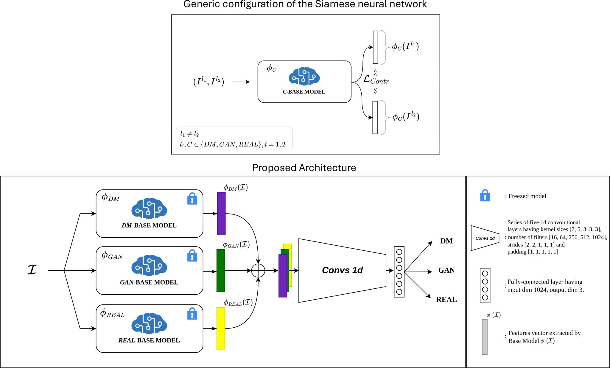

# DeepFeatureX Net: Deep Features eXtractors based Network for discriminating synthetic from real images

## Abstract
The rapid advancement of generative artificial intelligence, particularly in the domains of Generative Adversarial Networks (GANs) and Diffusion Models (DMs),
has led to the creation of increasingly sophisticated deepfakes. These synthetic images pose significant challenges for detection systems and present growing 
concerns in the realm of Cybersecurity. The potential misuse of deepfakes for disinformation, fraud, and identity theft underscores the critical need for robust 
detection methods. This paper introduces DeepFeatureX-SN (‘Deep Features eXtractors based Siamese Network’), an innovative deep learning model designed to address 
the complex task of not only distinguishing between real and synthetic images but also identifying the specific employed generative technique (GAN or DM). Our 
approach makes use of a tripartite structure of specialized base models, each trained using Siamese networks and contrastive learning techniques, to extract discriminative 
features unique to real, GAN-generated, and DM-generated images. These features are then combined through a CNN-based classifier for final categorization. Extensive 
experiments demonstrate the model’s superior performance, with a detection accuracy of 97.29%, strong generalization to unseen generative architectures (achieving an 
average accuracy of 67.40%, which surpasses most existing approaches by over 10%) and robustness against various image manipulations, all of which are crucial for 
real-world Cybersecurity applications. DeepFeatureX-SN achieves state-of-the-art results across multiple datasets, showing particular strength in detecting images 
from novel GAN and DM implementations. Furthermore, a comprehensive ablation study validates the effectiveness of each component in our proposed architecture. This 
research contributes significantly to the field, offering a more nuanced and accurate approach to identifying and categorizing synthetic images. The results obtained 
in the different configurations in the generalization tests demonstrate the good capabilities of the model, outperforming methods found in the literature.



For more information, here the link to the paper:
- Springer: [link](https://doi.org/10.1007/s11042-025-21060-1)

## Project Structure
This section outlines the recommended folder structure for the project. The working directory is where all the images for training and testing the models, as well as the model weights, are stored. 
The project is organized as follows:
```
working_dir/
├── datasets/                        # Training and testing datasets
├── testing_robustness/              # Data for testing model robustness
├── testing_generalization/          # Data for testing model generalization
├── guidance.csv                     # CSV file for data processing guidance
└── models/                          # Models and related files for the unbalancing approach
```
This structure is recommended but not mandatory. You can specify alternative paths as needed.
To use the suggested structure:

  1. Create a file named `wd.py` inside `src/dfx/`
  2. Add the following line to `wd.py`:
  ```{python}
  working_dir = '<your_working_directory_path>'
  ```
  3. Replace `<your_working_directory_path>` with your actual working directory path.

## Installation
  1. Clone the repository:
     ```{bash}
     git clone git@github.com:opontorno/DeepFeatureX-SN.git
     cd <repository_name>
     ```
  2. Install the `dfx` package and dependencies:
     ```{bash}
     pip install -e .
     ```


## Train the models
### Data preparation
  1. Organize your data following this structure:
  ```
    Datasets/
    ├── gan_generated/
    │   ├── AttGAN/
    │   ├── BigGAN/
    │   ├── CycleGAN/
    │   ├── GauGAN/
    │   └── .../
    ├── dm_generated/
    │   ├── DALL-E 2/
    │   ├── DALL-E MINI/
    │   ├── Glide/
    │   ├── Latent Diffusion/
    │   └── .../
    └── real/
        └── real/
  ```
  2. Create a guidance CSV file:
  ```{bash}
  python scripts/prep/make_guidance.csv --datasets_dir <your_data_dir> --saving_dir <your_save_path> --guidance_dir <your_guidance_path>
  ```

### Train Base Models
Train the three base models:
```{python}
python scripts/training/training_base-model.py --datasets_dir <your_data_dir> --main_class <main> --saving_path <your_save_path>
```
Replace `<main>` with one of: 'dm_generated', 'gan_generated', or 'real'.

### Train Complete Model
Train the complete model:
```
python scripts/training/training_complete-model.py --datasets_dir <your_data_dir> --main_class <main> --saving_path <your_save_path>
```

## Inference
Test the complete model specifying the `backbone` type and, if any, the `model_path`:
```{python}
python scripts/testing/testing_complete-models.py --backbone <backbone_type> --model_path <your_model_path> --test_raw True --datasets_dir <your_data_dir> --main_class <main> --saving_path <your_save_path>
```

## Dataset
The dataset comprises a total of $72,334$ images, distributed as shown in the Table. The image sizes vary considerably, ranging from 216x216 pixels up to 1024x1024 pixels, thus offering a wide spectrum of resolutions for analysis. For each generative architecture, special attention was paid to the internal balancing of the corresponding subset of images. This balancing was pursued in terms of both semantic content and size in order to minimise potential bias and ensure a fair representation of the different types of visual input. All images are in PNG format.

| Nature | Architecture   | Type | # Images | Total  | Different Sizes                               |
|--------|----------------|------|----------|--------|-----------------------------------------------|
| **GAN**| AttGAN     | FO   | 6005     |        | 256 × 256                                     |
|        | BigGAN      | O    | 2600     |        | 256 × 256                                     |
|        | CycleGAN   | FO   | 1047     |        | 256 × 256; 512 × 512                          |
|        | GauGAN     | O    | 4000     |        | 256 × 256; 512 × 512                          |
|        | GDWCT       | O    | 3367     | 37.572 | 216 × 216                                     |
|        | ProGAN     | O    | 1000     |        | 256 × 256; 512 × 512                          |
|        | StarGAN     | F    | 6848     |        | 256 × 256                                     |
|        | StyleGAN   | O    | 4705     |        | 256 × 256; 512 × 512                          |
|        | StyleGAN2  | FO   | 7000     |        | 256 × 256; 512 × 512; 1024 × 1024             |
|        | StyleGAN3  | F    | 1000     |        | 256 × 256; 512 × 512; 1024 × 1024             |
| **DM** | DALL-E 2   | FO   | 3421     |        | 512 × 512; 1024 × 1024                        |
|        | DALL-E MINI    | O    | 1000     |        | 256 × 256                                     |
|        | Glide     | O    | 2000     | 15.421 | 256 × 256; 512 × 512                          |
|        | Latent Diffusion  | FO | 4000 |      | 256 × 256; 512 × 512                          |
|        | Stable Diffusion      | FO | 5000 |      | 256 × 256; 512 × 512                          |

| Nature | Sources   | Type | # Images | Total  | Different Sizes                               |
|--------|----------------|------|----------|--------|-----------------------------------------------|
| **REAL** | CelebA   | F    | 5135     |        | 178 × 218                                     |
|          | FFHQ     | F    | 4981     | 19341  | 1024 × 1024                                   |
|          | Others    | O | 9225 |        | 256 × 256; 512 × 512; 1024 × 1024             |


## Citation
```
@article{pontorno2025deepfeaturex,
  title={DeepFeatureX-SN: Generalization of deepfake detection via contrastive learning},
  author={Pontorno, Orazio and Guarnera, Luca and Battiato, Sebastiano},
  journal={Multimedia Tools and Applications},
  pages={1--20},
  year={2025},
  publisher={Springer}
}
```

